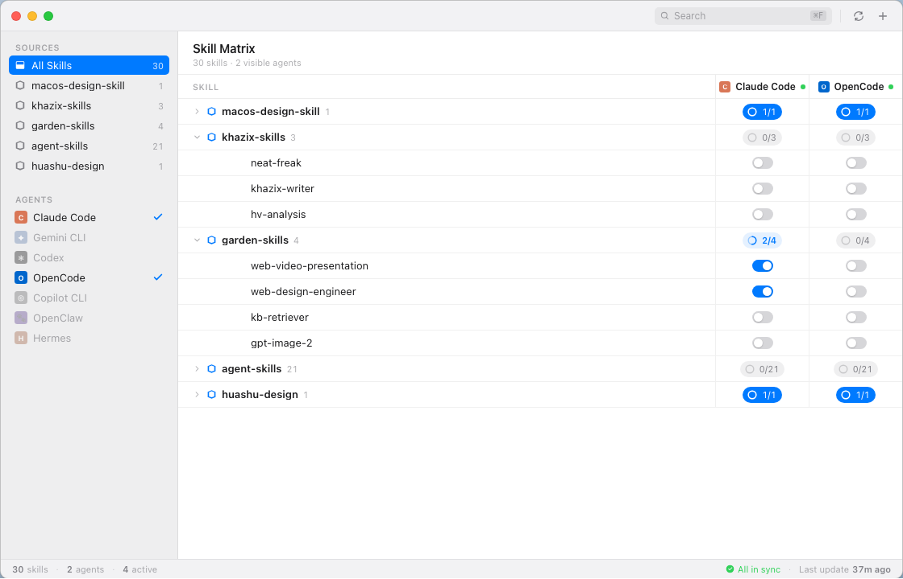

# SkillHub

管理 AI 编程 Agent Skills 的原生 macOS 应用。


[English](README.md) | 中文



## 这是什么

Claude Code、Codex、OpenCode 等 AI 编程 Agent 支持「Skills」——放进配置目录的 Markdown 文件，用来给 Agent 注入额外的上下文、指令或领域知识。当你同时用多个 Agent、又装了好几个 skill 来源时，管理起来很麻烦：哪个 skill 在哪个 Agent 里开着？怎么一次性开关一整个来源？

SkillHub 用一个窗口把这些全部理清楚。

## 功能

- **Skill 矩阵** — 每行一个 skill，每列一个 Agent，用开关直接控制
- **批量开关** — 点击来源或分组的聚合按钮，一次开关该来源下所有 skill
- **多来源** — 从 Git URL 或本地目录安装，多个来源可以共存
- **自动检测 Agent** — 通过配置路径自动识别已安装的 Agent���未安装的显示为灰色
- **实时同步** — 每次拨动开关立即写入 Agent 配置文件，无需手动保存
- **搜索** — 按名称过滤 skill（⌘F）
- **Git 更新** — 一键拉取 Git 来源的最新内容

## 支持的 Agent

| Agent | 配置路径 |
|---|---|
| Claude Code | `~/.claude/` |
| Gemini CLI | `~/.gemini/` |
| Codex | `~/.codex/` |
| OpenCode | `~/.config/opencode/` |
| Trae CN | `~/.trae-cn/` |
| OpenClaw | `~/.openclaw/` |
| Hermes | `~/.hermes/` |

## 系统要求

- macOS 14 Sonoma 或更新版本
- 从源码构建需要 Xcode 15+ 或 Swift 5.9+

## 构建与运行

```bash
git clone https://github.com/zzjzz9266a/skillhub.git
cd skillhub
swift run
```

或用 Xcode 打开：

```bash
open Package.swift
```

## 安装 Skill 来源

1. 点击工具栏的 **+**
2. 粘贴 Git URL（如 `https://github.com/someone/skills`）或本地路径
3. SkillHub 自动克隆/复制来源，并在矩阵中展示所有发现的 skill
4. 单独拨动 skill 开关，或点击来源聚合按钮批量开关

## Skill 的工作方式

Skill 是来源目录里的 Markdown 文件（`.md`）。SkillHub 读取 YAML front matter 获取元数据（名称、描述），并写入各 Agent 的配置文件来注册或注销该 skill。

```
my-skills/
├── code-review.md       # 一个 skill
├── web-design.md        # 另一个 skill
└── tools/
    └── sql-helper.md    # 归在 "tools" 分组下
```

## Roadmap

**v1.x — 打磨**
- [ ] 来源内自定义 folder — 不修改源仓库，在 SkillHub 里自由拖拽整理分组
- [ ] Skill 详情面板 — 描述、文件路径、各 Agent 启用状态一览
- [ ] 更新通知 — Git 来源有新提交时主动提示
- [ ] 全文搜索 — 支持搜索 skill 描述和 tag

**v2 — 扩展**
- [ ] 更多 Agent — Cursor、Aider、Continue.dev、Cline
- [ ] Skill Profile — 把一组开关状态存成「Web 开发模式」「数据分析模式」，一键切换
- [ ] iCloud 同步 — 多台 Mac 共享同一套开关状态

**v3 — 生态**
- [ ] Skill 市场 — 在 app 内搜索并安装 GitHub 上的公开 skill 仓库
- [ ] CLI 伴侣 — `skillhub enable <skill> --agent claude`

有想法？[提 Issue](https://github.com/zzjzz9266a/skillhub/issues)。

## 技术栈

- **SwiftUI + AppKit** — 原生 macOS UI，`NSVisualEffectView` 实现侧边栏毛玻璃效果
- **GRDB** — 基于 [GRDB.swift](https://github.com/groue/GRDB.swift) 的 SQLite 本地状态存储
- **Yams** — 基于 [Yams](https://github.com/jpsim/Yams) 的 YAML front matter 解析
- **Swift Package Manager** — 无需 Xcode 项目文件

## License

MIT
